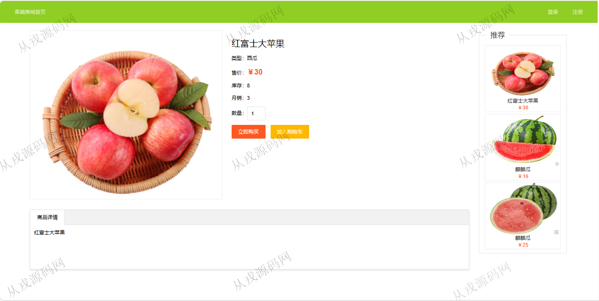
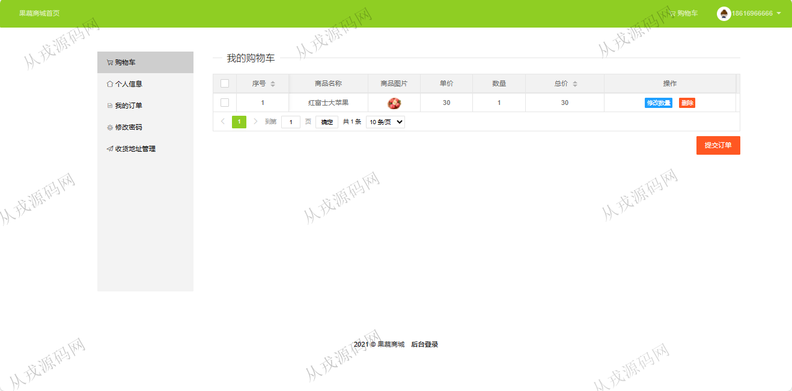
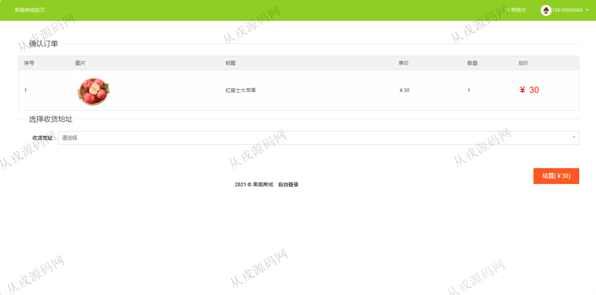
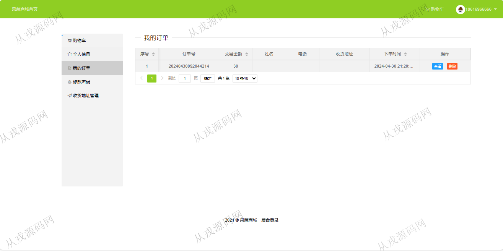
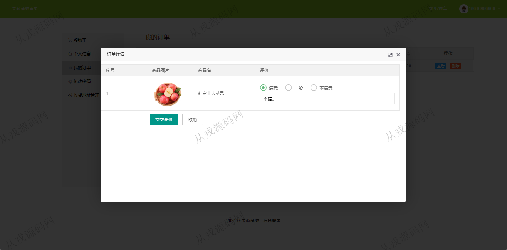
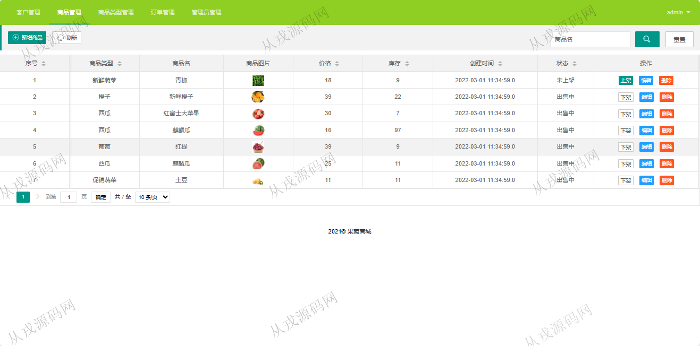
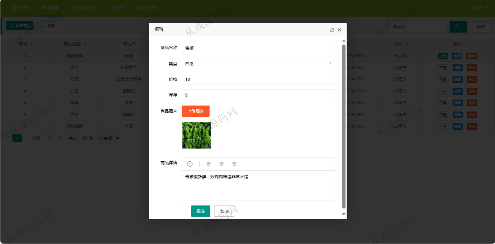
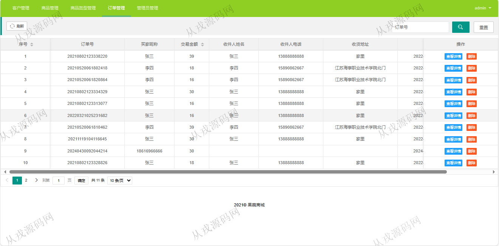

<h1 align="center">255.基于ssm的果蔬商城管理系统【含报告文档】</h1>

 获取sql文件 QQ: 386869957 QQ群: 377586148 

 [更多源码项目: 从戎源码网](https://armycodes.com/) 

## 简介

> 本代码来源于网络,仅供学习参考使用!
>
> 提供1.远程部署/2.修改代码/3.设计文档指导/4.框架代码讲解等服务
>
> 前台首页: http://localhost:8080/shop/mall/index
>
> 用户: 18616966666 密码: 123456
>
> 后端登录地址：http://localhost:8080/shop/admin/loginPage
>
> 管理员: 17615106458   密码: 123456
>

## 项目介绍
基于ssm的果蔬商城管理系统【含报告文档】：前端 jsp、jquery，后端 maven、springmvc、spring、mybatis；角色分为管理员、用户；集成商品浏览、购物车、结算（模拟）、订单查询等功能于一体的系统。

## 环境

- <b>IntelliJ IDEA 2021.3</b>

- <b>Mysql 5.7.26</b>

- <b>Tomcat 7.0.73</b>

- <b>JDK 1.8</b>

## 运行截图

